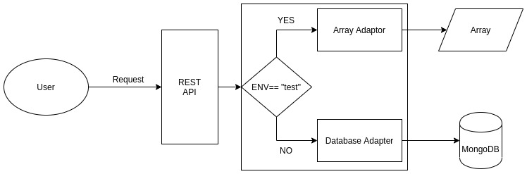

# REST API in NodeJs using OOPs, with implementation of DB Adapter

# Task
1. Create basic REST API in NodeJs with CRUD operations.
2. Use MongoDB.
3. Store data in Array.
4. Create MongoDB adapter to store data in MongoDB.
5. OOPS should be followed.

# Understanding the Adapter Design 
> The requested data can be stored or fetched in Array 
> But in non-test environment the same should happen but with mongoDB

